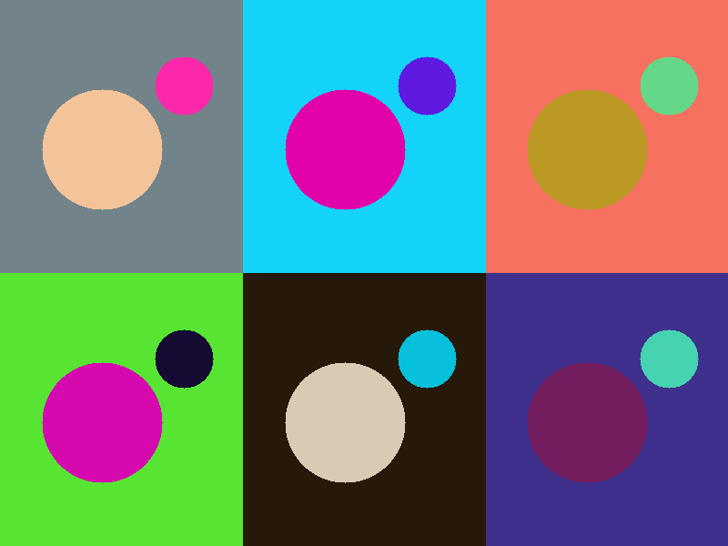

# Rust Random Art

Did a coding challenge to create a PNG image that had some sort of randomness as part of an offsite at work. Originally, I coded mine in Elixir. This is an attempt to recreate that random art but with Rust.

## How to Run

1. Run `cargo run`
2. Open `example.png`
3. View your new image.

## Example Result

